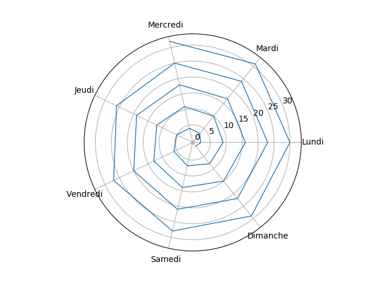

# snail-from-hell

A project for generating images from simple data source, like a csv for example


## Prerequisite

In order to use this project you need at least python 3.7, a git client  and know how to type basic command.

On most of Unix system, python comes pre installed so check it up :

```
python --version
>>> Python 3.7.3
```

Otherwise, follow [the procedure to install it](https://phoenixnap.com/kb/how-to-install-python-3-ubuntu).

Installing git works the same way :

```
sudo apt install git
git --version
```

##  Architecture and philosophy of the project

This projects is intended to provide to non-technical users script to  generate some charts or reports from data they got so please do not assume any technical skills or tools from your user.

For each process, document and use human readable term


### Archi 

- data folder : put all your data file. Each folder has its own README.md giving some tips about data. This data is intended for the non technical peoples.
- scripts folder : coder please put scripts that make stuff from data here

## Installing 

Go to any of your folder ant then :

```shell
git clone https://github.com/zarnold/snail-from-hell.git  #The project is open source so no password or ssh key
cd snail-from-hell
pip install -r requirements.txt  # Install all the required modules
python scripts/test-my-setup.py  # Test your setup. You should get a nice spiraling chart
```


## Usage

Each scripts should provide a helpme command but anyway, here some help :

1. Edit the "data/csv/data.csv" file with your data ( you can use excel)
2. Launch `python scripts/generate-snail.py` from the root of your project
3. Close the image that is presented to you
4. Grab your result in the results/latest/ folder ( and in the results/arhives)


### Troubleshooting

In most of case issue will arise from date encoding, oudated package or encoding. Refer to a technical friend for help as it s oftne tricky to deal with that.

## Publishing

If you made some change to any file, for example data/csv/data.csv, and want to  put it to the open source git repository, do it with this commands :

```
git pull --rebase origin master
git add <MY_FILE>
git commit -m " a message to everybody to convey you my intention"
git push origin master
```

Example with the data file :

```
git add data/csv/data.csv
git commit -m " a message to everybody to convey you my intention"
git pull --rebase origin master
git push origin master
```
> note to dev : Tis is obviously not good practice but git is tricky for beginner so please dont be an a***ole


## The last result

